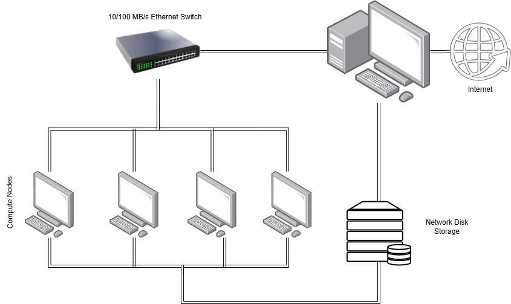
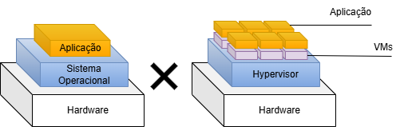
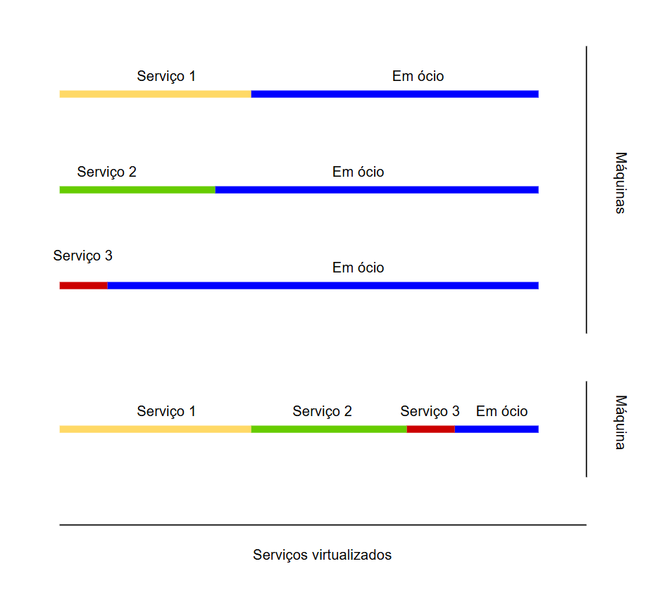

> 🚧 Documentação em andamento — atualizada continuamente.
# Cloud Fundamentals, Administration and Solution Architect

## Índice
- [Virtualização](#virtualização)
- [Cloud Computing](#cloud-computing)
- [Arquiteturas](#arquiteturas-e-aplicações-cloud)
- [AWS](#amazon-web-services-aws)
- [Azure](#azure)
- [GCP](#google-cloud-platform-gcp)
- [Docker](#docker)
- [Kubernetes](#kubernetes)
- [DevOps](#devops)

## Virtualização

### Introdução

O sistema operacional é como um grande "orquestrador", decidindo como otimizar e utilizar os recursos de hardware da melhor forma possível. Porém, em ambientes modernos de nuvem, temos de prontidão a possibilidade de, em um "passe de mágica", aumentar ou diminuir nossos recursos de *CPU*, *RAM* e *ARMAZENAMENTO*.

Nesse tópico, vamos abordar o mecanismo que torna possível essa manipulação e escalabilidade, a partir da técnica conhecida como **Virtualização**

### Como funciona?

A virtualização surgiu como uma forma de separar melhor o hardware do software. No modelo tradicional, os softwares são instalados em uma infraestrutura física (hardware). Porém sempre que essa infraestrutura não suportasse mais a demanda de usuários ou serviços, o hardware precisava ser substituído, o chamado *upgrade vertical*. Por outro lado criou-se também os clusters de computadores, múltiplas máquinas ligadas entre si e dividindo as tarefas, e aumentando as máquinas de acordo com a demanda de processamento necessários, chamado então de *upgrade horizontal*. Ainda neste modelo, cada um dos computadores mantinham sua própria estrutura de SO e seus próprios processos.  

*Fig.1 - Cluster de computadores.*

A virtualização revolucionou esse cenário ao abstrair o hardware físico, inserindo uma camada lógica que permite uma separação eficiente entre os recursos físicos e os sistemas operacionais. Como exemplo a virtualização permite, a instalação de vários sistemas operacionais em uma mesma máquina.

*Fig.2 - Tradicional vs Virtualização.*

Logo depois surgiu o inverso, um único ambiente virtualizado, gerenciado por um *hypervisor* que abstrai os recursos físicos do *cluster*, apresentando-os como um único *pool* de recursos para as máquinas virtuais consumirem. A máquina virtual compreende todo o *hardware* do *cluster* como um único supercomputador, com vários núcleos, memória e armazenamento, permitindo a flexibilidade no aumento destes recursos para a máquina virtual, sempre que houver a necessidade e a disponibilidade da infraestrutura física. Se o *cluster* físico atingir o limite, basta adicionar mais um servidor físico ao *cluster* (escalonamento horizontal) sem que a máquina virtual precise ser desligada ou reconfigurada, garantindo elasticidade e continuidade ao negócio.

### Benefícios

* **Redução de Custos:** A virtualização pode reduzir investimentos em hardware, energia e espaço físico, reaproveitando recursos ociosos.

* **Redução do tamanho do parque de equipamentos (*datacenter*):** Com o melhor aproveitamento dos recursos atuais, a necessidade de  aquisição de novos equipamentos diminui, reduzindo gastos com instalações, espaço físico, manutenção e assim por diante.

* **Gerenciamento centralizado:** Facilidade de monitorar serviços/processos em execução dependendo da estratégia de virtualização adotada.

* **Manutenção de sistemas legados:** Em casos de sistemas legados onde o *hardware* pode possuir mais de vinte anos e rodando em um SO obsoleto, apenas por requisitos de um serviço ou aplicação. A virtualização permite simular aquele *hardware* antigo e emular o SO necessário para dar continuidade ao sistema.

* **Ambientes de testes:** A virtualização permite criar ambientes isolados que simulam diferentes sistemas operacionais ou arquiteturas, sem a necessidade de adquirir equipamentos físicos dedicados para cada cenário de teste.

* **Confiabilidade e Segurança:** Com a VMs funcionando de maneira independente, se um problema surgir em uma delas, este não afetará as demais.

*Fig.3 - Serviços Virtualizados.*

### Infraestrutura

A Virtualização nos permite fornecer uma versão virtual de muitas tecnologias essenciais em computação, como principais podemos citar **Hardware**, **Armazenamento** e **Redes**, que serão detalhados a seguir. É importante entender que a virtualização é uma tecnologia de *software* que abstrai componentes físicos em camadas lógicas e consolida recursos em pools, permitindo executar várias VMs em uma única máquina física, cada uma com seu próprio SO e compartilhando os recursos dessa mesma máquina. O componente responsável por criar e gerenciar essas VMs é chamado de *Hypervisor*.

* **Hardware:** Chamado de HV - *Hardware Virtualization*. Esse é um dos principais itens sobre a virtualização, um sistema operacional pode ser instalado sobre outro tipo de sistema, com seus recursos de *hardware* sendo representados via *software* pelo *Hypervisor*.

* **Armazenamento:** Chamado também de SDS - *Software Defined Storage* (Armazenamento Definido por Software). É uma camada de *software* criada sobre discos físicos, onde os dispositivos acessam esses discos, de modo a tornar o acesso mais flexível, gerenciável e personalizável.

* **Redes:** Chamado de SDN - *Software Defined Networking* (Rede Definida por Software). É possível criar um tipo de infraestrutura lógica de redes sobre uma determinada rede física, permite a configuração e o detalhamento de acordo com as necessidades do ambiente.

Ao utilizar essas técnicas de virtualização, todos os dispositivos podem ser representados em forma de *softwares*: Servidores e estações de trabalho se tornam VMs, a rede e o armazenamento são virtualizados e se tornam **SDN e SDS**. E assim construímos o **SDDC - *Software Defined Data Center* (Data Center Definido por Software).**

## Cloud computing 

### Introdução

*Cloud Computing* (Computação em Nuvem) é o novo paradigma para a indústria da informática, surgiu com o objetivo de proporcionar disponibilidade e acesso a recursos por meio da *Internet*. Alterando o modelo de negócios das empresas da área de tecnologia da informação, assim como a forma como plataformas de *hardware* e *software* são agrupadas, integradas e comercializadas. 

Embora algumas tecnologias fundamentais para a *Cloud Computing* estejam disponíveis há algum tempo (Virtualização), a estrutura desse novo paradigma ainda está em desenvolvimento e possui diversos desafios a serem solucionados, como padronização, provisionamento de recursos, entre outros. 

### Infraestrutura Virtual

Como citado anteriormente a virtualização tem um papel fundamental para a *Cloud Computing*, através dessa tecnologia que pode-se pensar na infraestrutura em nuvem, como criar a disponibilidade de recursos de forma virtual para serem acessados via *Internet*. Os três principais tipos de virtualização são: virtualização computacional, de armazenamento e de rede. 

Os recursos virtuais são criados usando um software que permite aos provedores de serviços implantarem a infraestrutura mais rapidamente, em comparação com a implantação de recursos físicos. Redução de custos associados à compra de novo *hardware*, custos de espaço e energia associados à manutenção dos recursos. Além de diminuir a quantidade de pessoas necessárias para administrar esses recursos.

Como abordado na seção de [Virtualização](#virtualização), os recursos de 
**Hardware**, **Armazenamento** e **Redes** podem ser virtualizados. No contexto 
de Cloud Computing, esses conceitos se aprofundam em aspectos específicos:

#### Armazenamento 

* **Virtualização de blocos:** Refere-se à abstração do armazenamento lógico (partições) do armazenamento físico, essa separação permite aos administradores do sistema maior flexibilidade na maneira de gerenciar o armazenamento para usuários finais.

* **Virtualização de arquivos:** Aborda os desafios do **NAS (*Network-Attached Storage*)**, eliminando a necessidade do usuário conhecer o caminho físico do arquivo, tendo acesso a ele independente de onde esteja armazenado, o que melhora a otimização do armazenamento, a consolidação de servidores e permite migrações sem interrupções.

#### Redes

* **Virtual LAN (VLAN):** Uma LAN *Local Area Network* (Rede Local) virtual é uma rede virtual que consiste em computadores físicos e/ou virtuais, que dividem uma LAN em segmentos lógicos menores. Uma VLAN pode agrupar os nós independente de suas localizações físicas. 

* **Private Virtual LAN (PVLAN):** Uma PVLAN é uma extensão da VLAN, que segrega ainda mais os nós de uma VLAN primária em uma ou mais VLANs secundárias ou privadas. 

* **Virtual Extensible LAN (VXLAN):** Uma VXLAN é uma rede de sobreposição na camada 2 (Enlace) do modelo OSI, construída sobre uma rede camada 3 (Rede), permitindo estender redes virtuais além dos limites físicos e superar a limitação de 4096 VLANs, sendo amplamente utilizada em ambientes de cloud computing de larga escala. 

### Conceito

Segundo a definição do *National Institute of Standards and Technology* (NIST), *cloud computing* é "um modelo para permitir acesso conveniente e sob demanda à rede a um pool compartilhado de recursos de computação configuráveis, como redes, servidores, armazenamento, aplicativos e serviços; que podem ser rapidamente provisionados e liberados como o mínimo de esforço de gerenciamento ou interação do provedor de serviços"(NIST, 2011).
 
Uma infraestrutura em *cloud* é construída, operada e gerenciada por um provedor de *cloud*, que fornece serviços para seus consumidores como: **AWS**, **Azure** e/ou **GCP**.

Esse modelo de trabalho funciona com a interação de duas entidades, o **cliente** e o **provedor**. O cliente pode ser um indivíduo ou uma organização, enquanto o provedor pode ser externo ou interno à organização do consumidor, como o departamento de TI. O provedor mantém pools compartilhados de recursos de TI, esses que no caso são disponibilizados aos clientes a partir desse pool, por meio de uma rede, como a Internet ou uma intranet.

O conceito principal do modelo *cloud* é o pagamento apenas sobre os recursos e serviços utilizados pelo cliente. Com o provedor disponibilizando tais recursos e serviços em alta disponibilidade e isentando o cliente de qualquer responsabilidade sobre a infraestrutura física e em alguns casos até mesmo do gerenciamento dos recursos com serviços gerenciados.

### *On-Premise* VS *Cloud Computing*

Na estrutura *on-premise* ou também chamada tradicional de TI a aquisição de recursos de *hardware* e *software* não é tão simples e pode ser um processo demorado e burocrático dentro de uma organização, até porque não basta adquirir os recursos é preciso projetar o espaço físico, refrigeração, equipe para gerenciar e realizar a manutenção. Sem contar com a preocupação de atualização desse hardware posteriormente, onde o processo deve ser feito todo novamente. Isso pode levar ao aumento de custos e até mesmo a perda de oportunidades de mercado devido a falta de disponibilidade de recursos de imediato.

O *cloud computing* criado como promessa de solução desses problemas, já é uma realidade no mercado. Trazendo um modelo em que os clientes alugam recursos de TI, como armazenamento, processamento, largura de banda de rede, aplicativo ou uma combinação deles como serviços. Provisionando esses recursos em alta disponibilidade e escala sob demanda, atendendo os clientes de forma quase imediata tanto para aumentar quanto diminuir os recursos, a fim de atender o que o cliente precisa no momento certo, melhorando sua colocação no mercado e vantagem potencialmente competitiva.

Seguindo o conceito de "pague pelo que usar", e a resposta ágil em relação ao dimensionamento de recursos em nuvem, esse modelo permite a redução de custos em investimentos em infraestrutura de TI, otimiza a utilização de recursos, reduzindo também despesas associadas ao gerenciamento, manutenção, espaço, energia e refrigeração, permitindo focar os investimentos em novos negócios e inovações no mercado.

### Características Essenciais

Segundo a publicação SP 800-145, do NIST, a infraestrutura em *cloud* deve ter cinco características essenciais:

* **1. Autoatendimento sob demanda**
* **2. Amplo acesso à rede**
* **3. Agrupamento de recursos**
* **4. Elasticidade rápida**
* **5. Serviço mensurável**

#### Autoatendimento sob demanda

De acordo com o NIST, "Um consumidor pode provisionar recursos de computação unilateralmente, como máquinas virtuais, redes e armazenamento, conforme necessário, de maneira automática, sem exigir interação humana com cada provedor de serviços" (NIST, 2011).

O autoatendimento significa que o cliente provisiona por conta própria os recursos necessários através de alguma ferramenta disponibilizada pelo provedor. A forma mais comum é por meio de um portal de autoatendimento, onde o provedor disponibiliza um catálogo de serviços disponíveis para contratação, com seus respectivos preços por utilização.

#### Amplo acesso à rede

Essa característica diz respeito à disponibilidade de acesso aos serviços em *cloud* usando qualquer cliente ou dispositivo de terminal de qualquer lugar da rede, como a *Internet* ou rede privada de uma organização. O cliente deve ter a possibilidade de acessar os recursos que estão disponíveis na rede por meio de mecanismos padrão que promovem o uso por plataformas heterogêneas de *thin* (dispositivos com poucos recursos locais, dependentes da rede) ou *thick client* (dispositivos com processamento local), como, smartphones, tablets, laptops e estações de trabalho.

#### Agrupamento de recursos

Seguindo o conceito de virtualização, o agrupamento de recursos se trata de um *pool* de recursos agrupados como poder de computação, armazenamento e rede. Os serviços em *cloud* obtêm recursos de computação de *pools* e os alocam dinamicamente de acordo com a demanda do cliente. Os recursos liberados pelo cliente retornam ao pool para atender outras demandas, permitindo a alocação por outro cliente, esse conceito também é conhecido como modelo *multi-tenant* (multi-inquilino), onde um único conjunto de recursos pode atender mais de um cliente independente.

#### Elasticidade rápida

Refere-se à capacidade dos clientes de solicitar, receber e liberar rapidamente quantos recursos forem necessários, até um limite definido em contrato com o provedor para cada serviço em *cloud*. Essa característica permite que o cliente possa se adaptar às variações nas cargas de trabalho, aumentando os recursos, quando necessitar de mais desempenho e poder computacional ou liberando os recursos ociosos para reduzir custos.

#### Serviço mensurável

Uma *cloud* possui um sistema de medição que controla o consumo de recursos e ajuda a gerar faturas para os clientes com base nos recursos utilizados por eles. Ter um serviço mensurável permite tanto ao cliente se organizar e planejar, ciente de quanto pagará pelo que usar, quanto para os provedores de *cloud* no planejamento de capacidade e disponibilidade de serviços. Esse conceito está diretamente ligado ao modelo 'pague pelo que usar', reforçando a transparência e previsibilidade de custos tanto para o cliente quanto para o provedor. 

Exemplos de unidades de serviço: por GB de armazenamento, por transação e por hora/minuto/segundo de uso do serviço. 

### Benefícios

Depois de entender o que é o *Cloud Computing* e como ele está ganhando espaço na área de TI, podemos por fim listar quais são os principais benefícios que esse modelo pode trazer, que são:

* **Redução nos custos de TI:** Esse modelo permite que os clientes provisionem todos os recursos de TI necessários, seguindo o modelo de pague pelo que usar ou assinatura. Reduzindo os custos, pois o investimento é realizado apenas para adquirir os recursos necessários para acessar e gerenciar os serviços em *cloud*.

* **Alta disponibilidade:** O *cloud computing* trabalha com disponibilidade de recursos redundantes, garantindo atender a necessidade de acordo com a demanda do cliente e mantendo uma alta tolerância a falhas. Essas técnicas podem abranger vários datacenters localizados em diferentes regiões geográficas, o que evita a indisponibilidade de dados em razão de falhas regionais.

* **Escalabilidade:** Permite que os clientes dimensionem de forma unilateral e automática os recursos, sempre que necessário, a fim de atender à demanda de carga de trabalho. Evitando investir em recursos que ficariam ociosos após o uso.

* **Continuidade dos negócios:** O *cloud computing*, ao adotar o modelo de recursos redundantes, encadeia uma redução do prejuízo e indisponibilidade dos serviços por conta de desastres naturais, erros humanos, falhas técnicas e manutenções planejadas. Essa redundância permite que mesmo nesses momentos o impacto na continuidade dos negócios seja mitigado.

* **Maior colaboração:** Com o ambiente de trabalho em *cloud*, a possibilidade de colaboração entre diferentes grupos de pessoas, pode acontecer simultaneamente de qualquer local conectado à rede, com colaboradores trabalhando no mesmo projeto em tempo real.

* **Gerenciamento simplificado da infraestrutura:** Ao utilizar os serviços *cloud*, as organizações precisam gerenciar apenas os recursos necessários para acessar o ambiente *cloud* do provedor. A infraestrutura física principal é gerenciada pelo provedor e tarefas como atualizações e renovações de *software* e *hardware* são responsabilidade do provedor.

* **Flexibilidade de acesso:** Os aplicativos e dados residem centralmente e podem ser acessados de qualquer lugar da rede, a partir de qualquer dispositivo, como desktop, smartphone e *thin client*. Isso elimina a dependência do cliente em relação a um dispositivo de *endpoint* específico.

### Modelos de Serviço

O *cloud computing* é oferecido em diferentes modelos de serviço, que definem o nível de responsabilidade e controle do cliente sobre a infraestrutura. Segundo o NIST, existem três modelos principais:

* **IaaS - *Infrastructure as a Service* (Infraestrutura como Serviço):** É o modelo mais básico, onde o provedor disponibiliza ao cliente os recursos fundamentais de infraestrutura, como servidores virtuais, armazenamento e redes. O cliente é responsável pelo gerenciamento do SO, *middlewares* e aplicações, enquanto o provedor gerencia a infraestrutura física subjacente.

* **PaaS - *Platform as a Service* (Plataforma como Serviço):** Nesse modelo o provedor disponibiliza ao cliente uma plataforma completa de desenvolvimento, incluindo SO, *middlewares*, bancos de dados e ferramentas de desenvolvimento. O cliente é responsável apenas pelo desenvolvimento e gerenciamento de suas aplicações, sem se preocupar com a infraestrutura subjacente.

* **SaaS - *Software as a Service* (Software como Serviço):** É o modelo mais completo, onde o provedor disponibiliza ao cliente uma aplicação pronta para uso, acessada via *Internet*. O cliente não possui responsabilidade alguma sobre a infraestrutura, plataforma ou manutenção do *software*, apenas o utiliza. Exemplos comuns: **Gmail**, **Microsoft 365** e **Google Drive**.

### Modelos de Implantação

Além dos modelos de serviço, o *cloud computing* pode ser implantado de diferentes formas, de acordo com as necessidades e requisitos de cada organização:

* **Nuvem Pública (*Public Cloud*):** Os recursos de infraestrutura são disponibilizados ao público em geral pelo provedor de *cloud*, como **AWS**, **Azure** e **GCP**. Os recursos são compartilhados entre múltiplos clientes seguindo o modelo *multi-tenant*, e o cliente não possui responsabilidade sobre a infraestrutura física.

* **Nuvem Privada (*Private Cloud*):** A infraestrutura em *cloud* é provisionada para uso exclusivo de uma única organização. Pode ser gerenciada pela própria organização ou por terceiros e pode estar localizada nas dependências da organização ou fora delas. Esse modelo oferece maior controle e segurança, sendo comum em organizações com requisitos regulatórios mais rígidos.

* **Nuvem Híbrida (*Hybrid Cloud*):** É a combinação de dois ou mais modelos de implantação distintos, como nuvem pública e privada, que permanecem entidades separadas mas são interligadas por tecnologias que permitem a portabilidade de dados e aplicações entre elas. Esse modelo permite que a organização mantenha cargas de trabalho sensíveis na nuvem privada e utilize a nuvem pública para demandas de maior escalabilidade.

* **Nuvem Comunitária (*Community Cloud*):** A infraestrutura é compartilhada entre organizações que possuem interesses em comum, como requisitos de segurança, conformidade ou missão institucional. Pode ser gerenciada pelas próprias organizações ou por terceiros e pode estar localizada nas dependências de uma das organizações ou fora delas.

## Arquiteturas e aplicações cloud
## Amazon Web Services (AWS)
## Azure
## Google Cloud Platform (GCP)
## Docker
## Kubernetes 
## DevOps
